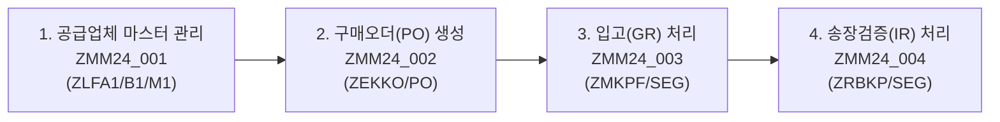
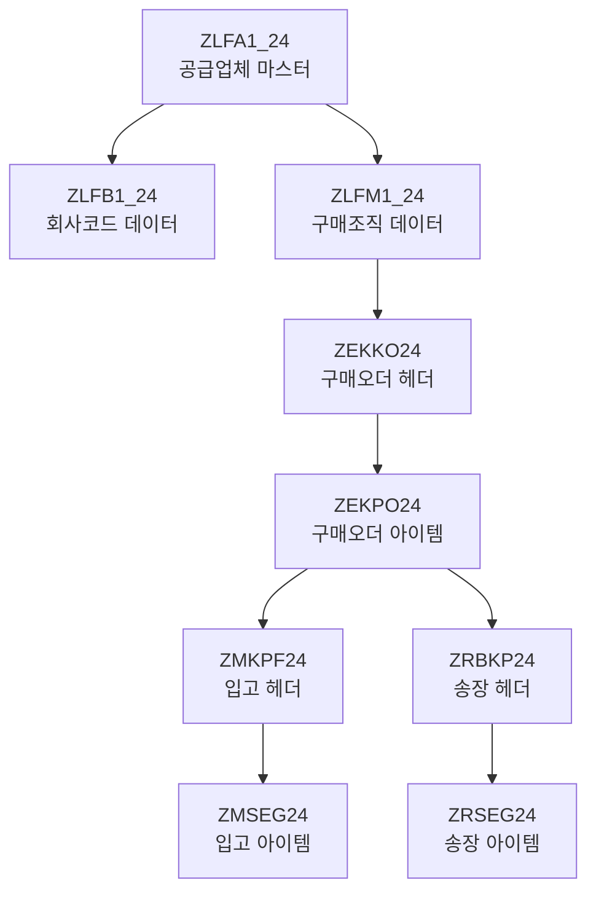

# SAP MM Module - Procure to Pay (P2P) 구현

> SAP Material Management 모듈의 핵심 Procure-to-Pay 프로세스를 ABAP으로 구현한 프로젝트입니다.
> 공급업체 마스터 관리부터 구매오더, 입고, 송장검증까지 전체 구매 프로세스를 커버합니다.

---

## 프로젝트 개요

| 항목 | 내용 |
|------|------|
| **모듈** | SAP MM (Material Management) |
| **구현 방식** | CBO (Custom Business Object) 기반 Module Pool |
| **개발 언어** | ABAP |
| **프로그램 수** | 4개 (ZMM24_001 ~ ZMM24_004) |
| **커스텀 테이블** | 14개 (마스터 4 + 트랜잭션 6 + 보조 4) |

---

## 비즈니스 프로세스 흐름



---

## 프로그램 상세

### 1. ZMM24_001 - 공급업체 마스터 관리

**기능:** 공급업체(Vendor) 마스터 데이터의 생성 및 조회

- **생성 모드**: 공급업체 ID, 회사코드, 계정그룹 등 마스터 정보 입력
- **조회 모드**: ALV Grid를 통한 공급업체 목록 조회 및 상세 정보 확인
- **데이터 구조**: 일반 데이터(ZLFA1_24) + 회사 데이터(ZLFB1_24) + 구매조직 데이터(ZLFM1_24)

| Screen | 용도 |
|--------|------|
| 0100 | 공급업체 마스터 생성 화면 |
| 0110 | 상세 정보 입력 서브스크린 |
| 0200 | ALV Grid 조회 화면 |

### 2. ZMM24_002 - 구매오더 관리

**기능:** 구매오더(Purchase Order) 헤더/아이템 생성 및 수정

- **생성 모드**: PO 헤더(회사코드, 공급업체, 구매일자) + 품목(자재, 수량, 단가) 입력
- **수정/조회 모드**: ALV Grid 인라인 편집을 통한 PO 아이템 수정
- **자동 처리**: 공급업체 마스터에서 통화(Currency), 세금코드(Tax Code) 자동 연동

| Screen | 용도 |
|--------|------|
| 0100 | PO 헤더 생성 화면 |
| 0101 | PO 아이템 입력 서브스크린 |
| 0200 | PO 조회/수정 화면 |

### 3. ZMM24_003 - 입고 처리

**기능:** 자재문서(Material Document) 생성을 통한 입고(Goods Receipt) 처리

- **생성 모드**: PO 참조 입고 - 발주 수량 대비 입고 수량 관리
- **조회 모드**: Tree Control + ALV Grid을 활용한 입고 이력 조회
- **수량 추적**: 발주수량(MENGE), 입고수량(WEMNG), 잔여수량(REMNG), 미처리수량(OPEN_QTY)

| Screen | 용도 |
|--------|------|
| 0100 | 입고 생성 화면 |
| 0101 | 입고 아이템 서브스크린 |
| 0200 | 입고 이력 Tree 조회 |
| 0201 | 아이템 상세 서브스크린 |

### 4. ZMM24_004 - 송장검증

**기능:** 공급업체 송장(Invoice) 수신 및 3-Way Matching 검증

- **생성 모드**: Tabstrip Control을 활용한 송장 헤더/아이템 입력
- **3-Way Matching**: 구매오더(PO) ↔ 입고(GR) ↔ 송장(Invoice) 대사 검증
- **세금 계산**: 세금코드별 세율 자동 적용 (V1=10%, V2=0% 등)
- **상태 관리**: 송장 상태 추적 (생성/전기/지급/역분개)

| Screen | 용도 |
|--------|------|
| 0100 | 송장 입력 (Tabstrip) |
| 0110 | 송장 상세 서브스크린 |
| 0200 | 송장 조회 Tree 화면 |
| 0210 | 아이템 상세 서브스크린 |

---

## 데이터 모델

### 마스터 데이터 테이블

| 커스텀 테이블 | SAP 표준 | 설명 |
|---------------|----------|------|
| ZLFA1_24 | LFA1 | 공급업체 일반 데이터 (이름, 주소, 국가, 세금번호) |
| ZLFB1_24 | LFB1 | 공급업체 회사코드 데이터 (G/L 계정, 지급조건) |
| ZLFM1_24 | LFM1 | 공급업체 구매조직 데이터 (구매그룹, 통화, 세금코드) |
| ZMARA24 | MARA | 자재 마스터 (자재유형, 기준가격, 통화) |

### 트랜잭션 테이블

| 커스텀 테이블 | SAP 표준 | 설명 |
|---------------|----------|------|
| ZEKKO24 | EKKO | 구매오더 헤더 (공급업체, 일자, 통화, 구매조직) |
| ZEKPO24 | EKPO | 구매오더 아이템 (자재, 수량, 단가, 저장위치) |
| ZMKPF24 | MKPF | 자재문서 헤더 (입고문서번호, 회계연도, 플랜트) |
| ZMSEG24 | MSEG | 자재문서 아이템 (자재, 수량, 이동유형, 차변/대변) |
| ZRBKP24 | RBKP | 송장문서 헤더 (송장번호, 금액, 세금, 상태) |
| ZRSEG24 | RSEG | 송장문서 아이템 (자재, 수량, 금액, 세금코드) |

### 데이터 흐름



---

## 기술 스택 및 구현 패턴

### ABAP 개발 패턴

- **Module Pool (Dialog Programming)**: 멀티 스크린 기반의 대화형 프로그래밍
- **ALV Grid (CL_GUI_ALV_GRID)**: 데이터 조회 및 인라인 편집
- **Tree Control (CL_GUI_SIMPLE_TREE)**: 문서 계층 구조 표시
- **Tabstrip Control**: 탭 기반 UI로 복잡한 데이터 입력 화면 구성
- **Class-based Event Handling**: ALV DATA_CHANGED 이벤트 핸들링
- **Docking / Custom Container**: 유연한 화면 레이아웃 구성

### 핵심 기술 요소

- **INNER JOIN**: 마스터/트랜잭션 테이블 간 복합 조회
- **MOVE-CORRESPONDING**: 구조체 간 자동 필드 매핑
- **Dynamic Screen Modification**: LOOP AT SCREEN을 활용한 화면 필드 동적 제어
- **Subscreen 설계**: 메인 스크린 + 서브스크린 조합으로 모듈화된 UI 구성

---

## 프로젝트 구조

```
SAP-MaterialManagement/
├── docs/
│   └── CBO_MM_Project.pptx          # 프로젝트 설계 문서
├── srcs/
│   ├── dictionary/                    # 공통 데이터 딕셔너리 정의
│   │   ├── zekko24.md                # PO 헤더 테이블 정의
│   │   ├── zekpo24.md                # PO 아이템 테이블 정의
│   │   ├── zmkpf24.md                # 자재문서 헤더 정의
│   │   ├── zmseg24.md                # 자재문서 아이템 정의
│   │   ├── zrbkp24.md                # 송장 헤더 정의
│   │   ├── zrseg24.md                # 송장 아이템 정의
│   │   ├── zmara24.md                # 자재 마스터 정의
│   │   └── ...
│   └── program/
│       ├── zmm24_001/                 # 공급업체 마스터 관리
│       │   ├── zmm24_001.abap        # 메인 프로그램
│       │   ├── zmm24_001_top.abap    # 전역 변수 선언 (TOP Include)
│       │   ├── zmm24_001_cls.abap    # 클래스 정의 (이벤트 핸들러)
│       │   ├── zmm24_001_pbo.abap    # PBO 모듈 (화면 출력 전 처리)
│       │   ├── zmm24_001_pai.abap    # PAI 모듈 (사용자 입력 처리)
│       │   ├── zmm24_001_f01.abap    # 서브루틴 (Form)
│       │   ├── zmm24_001_f02.abap    # 추가 서브루틴
│       │   ├── zmm24_001_scr.abap    # 선택 화면 (Selection Screen)
│       │   ├── screens/              # 스크린 정의 파일
│       │   └── dictionary/           # 프로그램별 딕셔너리
│       ├── zmm24_002/                 # 구매오더 관리
│       ├── zmm24_003/                 # 입고 처리
│       └── zmm24_004/                 # 송장검증
└── README.md
```

---

## SAP MM 모듈 Procure-to-Pay 프로세스

이 프로젝트는 SAP MM 모듈의 핵심 P2P(Procure-to-Pay) 사이클을 완전히 구현합니다.


**각 단계별 검증 포인트:**

1. **공급업체 마스터** → 구매오더 생성 시 통화/세금코드 자동 연동
2. **구매오더** → 입고 시 발주 수량 대비 입고 가능 수량 검증
3. **입고** → 송장검증 시 입고 수량/금액 대비 송장 금액 매칭
4. **송장검증** → 3-Way Matching (PO ↔ GR ↔ Invoice) 자동 대사

---

## 실행 환경

- **SAP System**: SAP ERP (ECC 6.0 이상)
- **개발 도구**: SAP GUI / SE80 (ABAP Workbench)
- **Transaction Codes**: SE38 (프로그램), SE11 (딕셔너리), SE51 (스크린 페인터)
